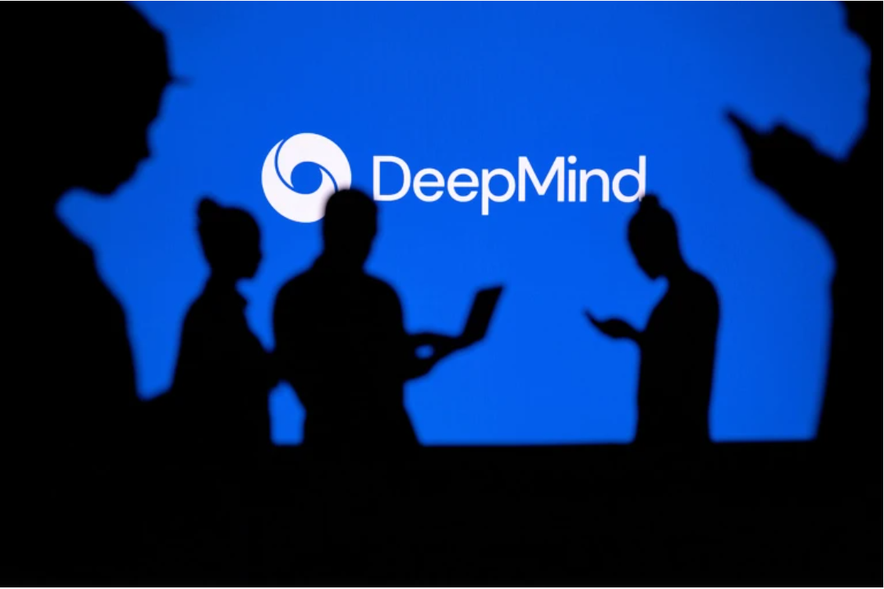
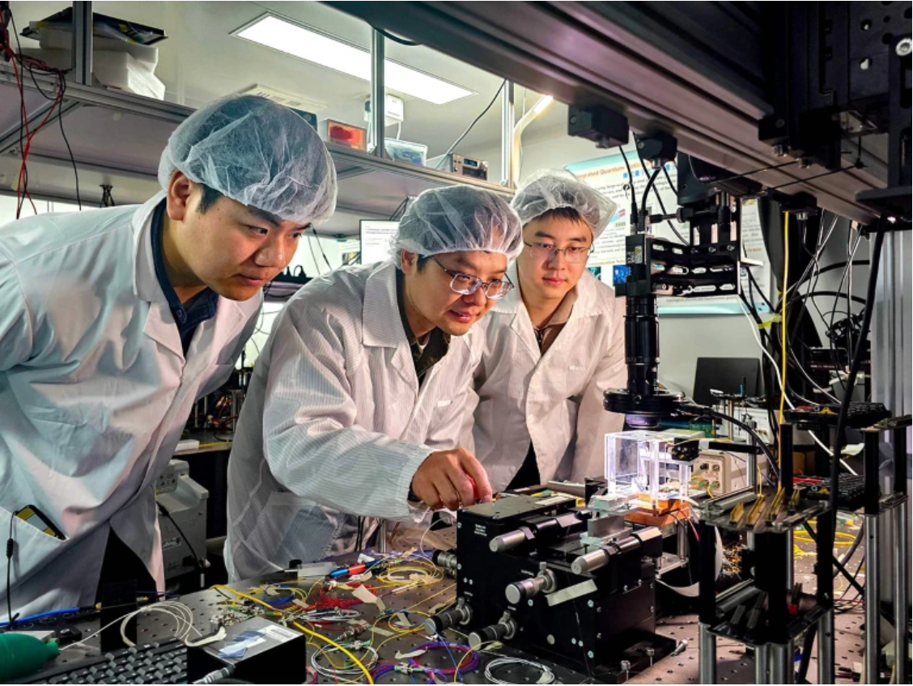

# 🌿 Nature Briefing (2026-01-31)
> **AI Engine:** RTX 5070 | **Mode:** Deep Reading

---

## 1. 48 hours without lungs: artificial organ kept man alive until transplant

> **📖 核心简报**
* 医疗团队开发了一种外部人工肺系统，使一名33岁的男子在等待双肺移植期间存活了48小时而没有自然肺。
* 该系统的独特之处在于它能够维持心脏的正常血流，减少血栓形成的风险，并且已经在临床上取得了成功。

> **🧪 研读词汇**
| Word | Phonetic | Chinese | Context |
|---|---|---|---|
| artificial lung system | yīnɡ zào fèi qì xì tǒng | 人工肺系统 | 医疗团队开发了一种外部**人工肺系统**，使一名33岁的男子在等待双肺移植期间存活了48小时而没有自然肺。 |
| acute respiratory distress syndrome | jí xìnɡ hào qì yōu zhèn zǒng jiē zhěn duì | 急性呼吸窘迫综合症 | 该患者之前患有由流感病毒引发的**急性呼吸窘迫综合症**，随后发展为药物耐药性的绿脓杆菌感染。 |
| extracorporeal membrane oxygenation (ECMO) | wài tǐ mèi mó yǎn qì huó dònɡ | 体外膜肺氧合 | 虽然有一种技术可以替代肺部的功能，即**体外膜肺氧合**(ECMO)，但患者的肺仍然在体内。 |
| septic shock | sè pò zhōu jīng | 感染性休克 | 该感染导致患者部分肺组织充满脓液，并且他进入了**感染性休克**状态，此时他的心脏和肾脏开始衰竭。 |
| cardiac arrest | xīn zàng diǎn jí | 心脏骤停 | “他病得如此严重，发生了**心脏骤停**，处于濒死状态。” |
| drug-resistant Pseudomonas aeruginosa infection | yào wù nài yào de qì zhēn ménɡ bāo zǐ shǔ jí bìnɡ | 药物耐药性绿脓杆菌感染 | 他随后发展为药物耐药性的**绿脓杆菌感染**。 |
| extracorporeal system | wài tǐ xì tǒng | 体外系统 | Rogers 表示，该团队的人工肺系统可以用于其他重症患者，在他们健康到足以接受肺移植之前维持其生命。 |
| registry | jí cè bù | 登记簿 | 目前我们将在 Northwestern 医院为即将死亡的病人提供这种服务，并将建立一个**登记簿**来跟踪这些病人的结果和他们的预后。 |

> **📜 原文归档 (Length: 4020)**
---
　　Rachel Fieldhouse is a reporter for Nature in Sydney, Australia.

　　A 33-year-old man survived for 48 hours without his lungs, after a medical team replaced the organs with an external artificial-lung system that it developed to keep him alive until he could receive a double lung transplant.

　　There have been cases in which people have had their lungs removed and been connected to an external device to maintain oxygen levels. But, the devices used in these cases don’t count as artificial lungs because they do not maintain blood flow across the heart, meaning it cannot function normally, says Ankit Bharat, a thoracic surgeon at Northwestern University Feinberg School of Medicine in Chicago, Illinois, who helped to develop the artificial system.

　　Bharat says his team’s design is unique because it maintains a balanced and continuous flow of blood to the heart, reducing the risk of blood clots that could trigger a heart attack. The findings were published today in the journal Med.

　　The engineering behind the artificial-lung system is remarkable, says Natasha Rogers, a transplant clinician at Westmead Hospital in Sydney, Australia. It is difficult to maintain normal heart function in the absence of lungs, she says. “They were really very brave.”

　　The team’s artificial-lung system could be used in other critically unwell people while they become healthy enough to receive lung transplants, she adds.

### Life-threatening condition

　　Before being placed on the artificial-lung system, the man had developed acute respiratory distress syndrome — an often-life-threatening condition in which the lungs cannot absorb enough oxygen — triggered by the influenza virus. He was then placed on a ventilator but developed a drug-resistant Pseudomonas aeruginosa infection. The infection caused parts of his lungs to fill with pus, and he went into septic shock, at which point his heart and kidneys began to fail.

　　“He was so sick, he had a cardiac arrest and he was actively dying,” says Bharat. Because the man was too unwell to receive a lung transplant, the team decided to remove his lungs — the source of the infection.

　　Surprisingly, the man began to improve quickly. “Within 48 hours, he was off all the medication to support his blood pressure, his kidney function was completely restored and his heart was working normally,” says Bharat. At that point, the man received a double lung transplant and has showed no signs of organ rejection or impaired lung function years later. “We are now approaching almost three years since we did this, and the patient is doing really great,” says Bharat.

### Pandemic invention

　　When they were introduced to the man, Bharat and his team had been working on an artificial-lung system to support people who were critically ill with COVID-19. The system was designed to get them healthy enough to be eligible for a lung transplant.

　　Although there is a technology that can take over the work that the lungs do — to oxygenate blood and remove carbon dioxide — called extracorporeal membrane oxygenation (ECMO), the person’s lungs are kept in their body, which keeps the heart stable. Rogers says the new system is connected to the heart and is a modified version of ECMO that maintains the right pressure for blood to flow to and from the heart.

　　Rogers says the study reveals that the lungs can be temporarily removed from the body for long periods of time. “A theoretical possibility is that you could take the lungs out, maintain the person on this type of modified extracorporeal system, treat the lungs and theoretically put the lungs back,” she says. But using the system requires multiple, specialist teams, meaning that only large hospitals would be able to use it.

　　Bharat is hoping that the system will be commercialized in the future for use in any hospital. “Right now, we’re going to offer it to patients at Northwestern who are about to die, and we’re going to keep a registry to keep track of these patients and their outcomes.”

---

## 2. How DeepMind's genome AI could help solve rare disease mysteries

> **📖 核心简报**
* DeepMind开发的AlphaGenome人工智能模型被用于解决罕见疾病的诊断难题，该模型能够预测非编码DNA序列中的突变对附近基因活性的影响。
* 在去年9月举行的未确诊疾病黑客松活动中，研究人员使用AlphaGenome来分析29种未确诊条件，尽管没有直接得出诊断结果，但为未来的研究提供了宝贵的经验和数据。

> **🧪 研读词汇**
| Word | Phonetic | Chinese | Context |
|---|---|---|---|
| genome | 'dʒiː.noʊm | 基因组 | AlphaGenome — an AI model developed by Google DeepMind in London that was described in Nature on 28 January. |
| non-coding DNA sequences | nɑn'koʊdɪŋ dɛnə 'siːkwənsiz | 非编码DNA序列 | AlphaGenome can predict the diverse effects of mutations in non-coding DNA sequences, including how they might affect the activity of nearby genes. |
| bioinformatician | baɪoˌɪnfɔrˈmeɪʃən ɪˈsteɪnjən | 生物信息学家 | Eric Klee, a bioinformatician at the Mayo Clinic in Rochester, Minnesota, who co-led the Undiagnosed Hackathon in September last year. |
| triage | trɪdʒ | 分类处理 | “These are variants that, to be quite honest, often get triaged,” says Eric Klee. |
| exome | 'ɛksəm | 外显子组 | Efforts to diagnose rare diseases tend to focus on mutations in protein-coding regions of the genome, known as the exome. |
| recessive gene mutation | rɪ'sɛsɪv ˈdʒin mjuː'teɪʃn | 隐性基因突变 | These tended to be in patients who carried one copy of a 'recessive' gene mutation that can cause disease if another mutation affects the other copy of the gene. |
| RNA expression data | rna eksprɛ'siʃn dætə | RNA表达数据 | Klee is hopeful that further RNA expression data will soon confirm an eighth. |
| missense mutations | mɪsˈɛns ˈmjuːˌteɪ.ʃənz | 错义突变 | Rothmund–Thomson syndrome, which affects the eyes, skin and other organ systems. |
| non-commercial use | nɑn kə'mɜrʃl juːz | 非商业用途 | Google DeepMind has released the code and weights underlying AlphaGenome for non-commercial use. |

> **📜 原文归档 (Length: 4676)**
---
　　When more than 100 researchers voluntarily locked themselves in a room last year to tackle some of the hardest conditions in medicine, they turned to artificial intelligence.

　　As part of an effort, called the Undiagnosed Hackathon, to crack 29 undiagnosed conditions researchers deployed AlphaGenome — an AI model developed by Google DeepMind in London that was described in Nature on 28 January.

　　AlphaGenome — an AI tool that was made available to scientists last year — can predict the diverse effects of mutations in non-coding DNA sequences, including how they might affect the activity of nearby genes.

　　Deciphering the 98% of the human genome that does not code for proteins is one of biology’s grand challenges. Mutations in these sequences are especially vexing to researchers seeking to uncover the genetic basis for rare, often fatal diseases.

　　“These are variants that, to be quite honest, often get triaged,” says Eric Klee, a bioinformatician at the Mayo Clinic in Rochester, Minnesota, who co-led the Undiagnosed Hackathon in September last year.

### Undiagnosed rare diseases

　　The three-day event at the Mayo Clinic in Rochester, as well as two previous hackathons in Europe, were organized by the Wilhelm Foundation — a charity in Brottby, Sweden, that advocates for families affected by undiagnosed rare diseases. The charity was founded by Helene and Mikk Cederroth, who lost three of their four children to an undiagnosed disease, and named the foundation after their eldest son, who died at the age of 16.

　　Around 350 million people have an undiagnosed rare condition, but only a fraction can be diagnosed using existing technologies such as genome sequencing. “If you don’t have a diagnosis, you are left behind,” says Helene Cederroth.

　　Efforts to diagnose rare diseases tend to focus on mutations in protein-coding regions of the genome, known as the exome. To see if AlphaGenome could help to interpret the effects non-coding variants, Klee tested its prediction for a variant that he and his colleagues had linked to an individual’s diagnosis, before the September 2025 hackathon.

　　Experimental work showed that the mutation altered gene expression in cardiac cells, but not in neural cells, which was in line with the symptoms the individual experienced. AlphaGenome’s predictions of the variant’s effects supported this conclusion, Klee says.

### Diagnostic hackathon

　　At the Mayo Clinic hackathon, researchers turned to AlphaGenome to investigate several conditions, Klee says. These tended to be in patients who carried one copy of a 'recessive' gene mutation that can cause disease if another mutation affects the other copy of the gene. The researchers used the AI tool to predict the effects of suspect non-coding variants, then see if they might lead to a disease. However, none of these predictions led to a diagnosis, Klee says.

　　Of the 29 conditions that the Undiagnosed Hackathon took on, six were diagnosed at the event using other approaches, another has since been linked to a mutation and Klee is hopeful that further RNA expression data will soon confirm an eighth. The next Undiagnosed Hackathon will take place from 3 to 5 February in Hyderabad, India.

　　Klee hopes that AlphaGenome and other AI tools will soon prove helpful in diagnosing rare diseases, when other approaches fail. As a result of the Hackathon, dozens of rare disease researchers now have experience with the tool. “We’ve opened up the door to 100-plus people from around the world on how you can think about using something like AlphaGenome,” Klee says.

　　At a previous Undiagnosed Hackathon, held in the Netherlands in 2024, researchers used a Google DeepMind model, called AlphaMissense, for deciphering the effects of protein sequence-altering mutations. The event help diagnose someone with a rare condition called Rothmund–Thomson syndrome, which affects the eyes, skin and other organ systems.

　　Last year, a team of researchers used another AI model to predict the effect of such 'missense' mutations called popEVE to identify more than 100 potential disease-causing genes using genome data from people with developmental disorders. They are now collaborating with researchers in Senegal to help in the diagnosis of rare conditions.

　　Google DeepMind has released the code and weights underlying AlphaGenome for non-commercial use, which could make it easier for researchers to customize the model to help diagnose rare disease. During the hackathon last year, researchers used the model to predict the effects of one specified variant at a time, but it would be more useful to assess numerous mutations at once, Klee says.

---

## 3. China is betting on ‘optical’ computer chips – will they power AI?

> **📖 核心简报**
* 光学芯片由于其高速度和低能耗，可能解决当前电子芯片在运行高级人工智能模型时遇到的速度和效率问题。
* 中国在过去十年中对光学芯片领域进行了战略投资，并且在该领域的研究产出显著增加。美国也增加了相关研究的投入，但增幅不及中国。

> **🧪 研读词汇**
| Word | Phonetic | Chinese | Context |
|---|---|---|---|
| optical chips | óptik chīps | 光学芯片 | 这些半导体芯片使用光而不是电来运行。 |
| photonic chips | fōtōnik chīps | 光子芯片 | 中国研究人员去年发表了476篇关于光子芯片的论文，是所有国家中最多的。 |
| semiconductor chips | sēmikəndūtər chīps | 半导体芯片 | 这些芯片需要使用最先进电子芯片来训练和部署大型AI模型。 |
| high-quality publications | hāiˈkwaɪlt pʌblikˈeɪʃənz | 高质量论文 | 他看到来自中国的高质量光子芯片论文数量显著增加。 |
| nanoscale | nānōskel | 纳米级 | 这些研究人员使用了密集集成的超表面，这些是纳米级工程设计来操纵光线的堆叠层。 |
| photonic neurons | fōtōnik ˈnuːrənz | 光子神经元 | 允许他们将数百万个光子神经元整合到芯片中。 |
| transistors | trænsˈɪstərz | 晶体管 | 电子芯片通过晶体管操纵电压。 |
| resistive losses | rɪˈzɪstɪv lɑːsɪz | 阻性损耗 | 光子芯片没有同样的阻性损耗，但它们确实需要激光器、探测器和调制器等支持组件。 |
| modulators | məˈdjuleɪtərz | 调制器 | 支持光子芯片的硬件是否最终消耗更多能量以抵消光学芯片的优势？ |
| scalability | skæləˈbiliti | 可扩展性 | 光学芯片架构根据其用途而变化，这使得构建类似于NVIDIA芯片的一般目的光学处理器变得困难。 |
| hybrid computing ecosystem | ˈhaɪbrɪd kəmˈpjutɪŋ ɪˈkɒsɪstəm | 混合计算生态系统 | 光学芯片不太可能完全取代多功能电子处理器，而是可能会作为更广泛混合计算生态系统的专用组件出现。 |

这些词汇涵盖了文章中的关键技术和概念，并提供了中文解释以便更好地理解其含义和应用背景。

> **📜 原文归档 (Length: 5315)**
---
　　As generative artificial-intelligence models become more sophisticated and eat up more energy to produce images and videos, the electronic chips that power them are reaching their limits of speed and efficiency. Optical chips – semiconductor chips that run on light rather than electricity – could solve these problems, say researchers working in the field.

　　Such chips, also called photonic chips, are still years away from being integrated into consumer computers and are unlikely to wholly replace electronic chips. However, optical chip research has grown drastically in the past five years, with China leading the charge.

　　“China has for the past decade invested strategically in infrastructure, capability and talent” in this field, says Ben Eggleton, a physicist at the University of Sydney, Australia. Eggleton, who was the editor-in-chief of APL Photonics for more than a decade until his tenure ended in December 2025, says that he has seen an increase in the number of high-quality publications on photonic chips from China.

　　Chinese researchers published 476 papers on optical chips last year, the most of any country, according to a Nature analysis of papers in the Dimensions database (part of Digital Science, a firm operated by the Holtzbrinck Publishing Group, which has a share in Nature’s publisher, Springer Nature). The number of Chinese-authored papers grew by tenfold between 2017 and 2025. The United States was the next top producer, with an output that more than doubled during that period.

　　China’s embrace of optical computing has accelerated in the wake of US policies to limit China’s access to the most advanced electronic chips and to restrict the equipment necessary to manufacture them. Such chips are needed to train and deploy large AI models.

　　The restrictions have sharpened China’s incentive to find alternative pathways to high-performance computing, says Zengguang Cheng, a materials scientist at Fudan University in Shanghai, China. “China’s 14th five-year plan finds mention of photonics, along with quantum computing projects. China’s government has provided sustained investments for this,” he adds.

### Computation challenges

　　Optical chips transmit information using photons rather than electrons. Because photons travel fast and do not shed energy as heat, optical systems can perform better than electronic ones and have lower energy loss. Such chips are already found in sensors, data communication systems and biomedical devices. But using them to perform computation — particularly for generative AI tasks — poses extra challenges.

　　Electronic chips manipulate voltages using transistors. Photonic chips, by contrast, depend on controlling the amplitude, phase and interference patterns of light. This makes them energy efficient but harder to scale, reconfigure and train for complex tasks, says Yitong Chen, an electronic engineer at Shanghai Jiao Tong University in China. Until recently, most photonic chips could perform only narrow functions, such as classifying images.

　　Last month, Chen and colleagues unveiled the first all-optical chip, called LightGen, that can run advanced generative AI models to produce images and videos.

　　The researchers used densely integrated metasurfaces — stacked layers engineered to manipulate light at the nanoscale, which allowed them to integrate millions of photonic neurons into the chip. They also developed a training algorithm tailored specifically for optical systems. According to the team, LightGen generated images, edited video content and even produced 3D scenes at speeds and energy efficiencies exceeding those of high-end processors, such as NVIDIA’s A.

　　Eggleton says that the work is an impressive proof of concept for a fast and energy-efficient photonic chip that can complete specific tasks.

　　Cheng says the Chinese government is encouraging closer collaboration between industry and academia. This, he says, “creates a powerful support for the development of the technology” and has accelerated commercialization through photonic chip start-ups, such as LightStandard and InnoLight, both in Suzhou, China.

### Engineering hurdles

　　Although photonic chips have clear advantages, they will also need to overcome engineering challenges to be able to power generative AI models more widely. The transistors in electronic chips generate resistance, which in turn results in energy loss through heat. Photonic chips do not have the same resistive losses, but they do require supporting components — such as lasers, detectors and modulators — that all require energy. “Will the supporting hardware end up consuming more energy that offsets the gains of the optical chip? That is a question that will only be answered once the chips are in practical use,” says Eggleton.

　　Scalability is another unresolved issue. Electronic chip design can be used for many purposes, whereas the architecture of optical chips changes depending on their use, says Cheng. This makes it difficult to build a single, general purpose optical processor analogous to a NVIDIA chip.

　　Eggleton says that optical chips are unlikely to replace multifunctional electronic processors outright. Instead, they will likely emerge as specialized components in a broader, hybrid computing ecosystem, he says.

---

