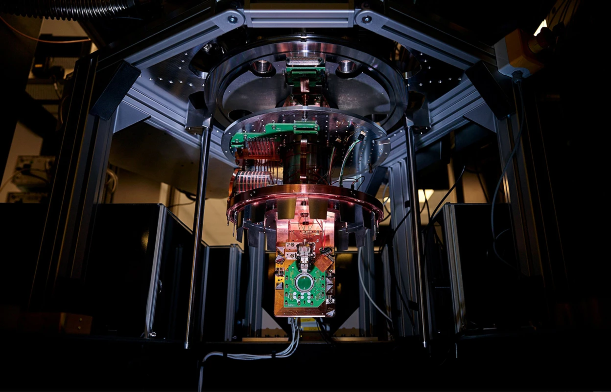

# 🌿 Nature Briefing (2026-02-05)
> **AI Engine:** RTX 5070 | **Mode:** Deep Reading

---

## 1. How tumours trick the brain into shutting down cancer-fighting cells

> ⚠️ AI 思考超时: HTTPConnectionPool(host='localhost', port=11434): Read timed out. (read timeout=180)

> **📜 原文归档 (Length: 4248)**
---
　　Tumours boost their own growth by attracting and then commandeering nearby sensory neurons, a study finds. By ‘plugging into’ tumour cells, these neurons can send a signal to the brain that subdues the protective activity of immune cells at the tumour site — allowing the cancerous cells to proliferate unchecked.

　　The study, published today in Nature, pinpointed this signalling pathway, from the tumour to the brain and back again, in mice with lung cancer. “The tumour hijacks the signalling axis and uses it for its own purpose,” says Anna-Maria Globig, a cancer immunologist at the Allen Institute for Immunology in Seattle, Washington.

　　When the authors of the study used genetic engineering to inactivate, or ‘knock out’, the sensory neurons, they “saw such a huge, dramatic reduction” in tumour growth — more than 50% — says co-author Chengcheng Jin, a cancer immunologist at the University of Pennsylvania in Philadelphia.

### Making a connection

　　Researchers have long known that nerve cells reside in tumours. “We know that nerves are there,” says Moran Amit, a head and neck surgeon at the University of Texas in Houston. But working out how these nerve cells affect a tumour’s survival has been difficult, he adds.

　　One reason is that genetic tools haven’t always been sophisticated enough to precisely analyze neurons' activity. Another is that neurons are the body’s longest cells; their DNA and RNA are mostly stored in cell bodies that sit far away from the fibre-like tendrils, called dendrites, that plug into tumours. So it is hard for researchers to collect much genetic information about the neurons during tumour biopsies. The peripheral nervous system is “the last area that really wasn’t being studied” in the context of cancer, says Timothy Wang, a gastroenterologist at Columbia University in New York City.

　　Jin and her colleagues, who had microscopy data showing neurons surrounding and penetrating lung tumours, hoped to make progress by inactivating certain neurons, either with genetic techniques or drugs, and observing the effects on cancer growth. “We took almost a year trying different drugs,” says co-author Haohan Wei, a cell biologist also at the University of Pennsylvania. “There wasn’t any effect.”

　　Then, “really by chance”, the research team met Rui Chang, a neuroscientist at Yale University in New Haven, Connecticut, who specializes in genetic knock-out techniques. The team collaborated with Chang to inactivate specific sensory neurons in the vagus nerve — a crucial signalling highway between the brain and many organs in the body, including the heart and lungs. By doing this, the researchers identified a signalling pathway between the brain and lung tumours in the mice. They also learnt that when the tumours hijacked this pathway, separate neurons running from the brainstem back to the tumour released a chemical called noradrenaline that ultimately suppressed tumour-killing immune cells in the mice.

　　It wasn’t obvious that the neurons would have the harmful effect of preventing the immune system from fighting cancer. In fact, Chang says he expected to find the opposite effect — that the neurons would warn the brain about the tumours and help the mice to fight them.

### Surprise, surprise

　　Now, researchers are offering some possible explanations. The immune cells that responded to the nerve signals, called macrophages, are essential for wound healing, says Isaac Chiu, an immunologist at Harvard Medical School in Boston, Massachusetts. The fact that there is a pathway that can halt this immune activity, Chiu adds, is probably “to shut down harmful inflammation”.

　　Studies such as this one gratify researchers who have faced pushback when they originally established a connection between nerves and tumours. “I’m really happy that the community are not sceptical anymore,” says Claire Magnon, a cancer neuroscientist at the French National Institute of Health and Medical Research in Paris, who was the first to publish molecular work showing that nerves can promote cancer progression. “We are just at the beginning of trying to understand how those nerves develop.”

　　Read the related News & Views ‘Tumour-to-brain pathway limits anticancer defence’.

---

## 2. Quantum computers will finally be useful: what’s behind the revolution

> ⚠️ AI 思考超时: ('Connection aborted.', RemoteDisconnected('Remote end closed connection without response'))

> **📜 原文归档 (Length: 14846)**
---
　　Just a few years ago, many researchers in quantum computing thought it would take several decades to develop machines that could solve complex tasks, such as predicting how chemicals react or cracking encrypted text. But now, there is growing hope that such machines could arrive in the next ten years.

　　A ‘vibe shift’ is how Nathalie de Leon, an experimental quantum physicist at Princeton University in New Jersey, describes the change. “People are now starting to come around.”

　　The pace of progress in the field has picked up dramatically, especially in the past two years or so, along several fronts. Teams in academic laboratories, as well as companies ranging from small start-ups to large technology corporations, have drastically reduced the size of errors that notoriously fickle quantum devices tend to produce, by improving both the manufacturing of quantum devices and the techniques used to control them. Meanwhile, theorists better understand how to use quantum devices more efficiently.

　　“At this point, I am much more certain that quantum computation will be realized, and that the timeline is much shorter than people thought,” says Dorit Aharonov, a computer scientist at Hebrew University in Jerusalem. “We’ve entered a new era.”

### Error prone

　　The latest developments are exciting to physicists because they address some of the main bottlenecks preventing development of viable quantum computers. These devices work by encoding information in qubits, which are units of information that can take on not just the values 0 or 1, like the bits in a classical computer, but also a continuum of possibilities in between. The prototypical example is the quantum spin of an electron, which is the quantum analogue of a magnetic needle and can be oriented in any direction in space.

　　The heart of a typical quantum computation consists of a series of gates, which are operations that manipulate the state of qubits. Gates can be performed on a single qubit, for example rotating a spin by a certain angle, or on more than one qubit. Crucially, a gate can put multiple qubits in collective entangled, or strongly correlated, states — exponentially boosting the amount of information that they can handle. Every computation then concludes with a measurement, which extracts information from the qubits, destroys the intricate quantum state produced by the gates and returns an answer in the form of a string of ordinary digital bits.

　　For decades, researchers questioned the viability of this computational paradigm owing to two main reasons. One is that, in practice, quantum states tend to naturally and randomly drift, and after a certain amount of time, the information they store is inevitably lost. The other is that gates and measurements can themselves introduce errors. Even operations as simple as using electromagnetic pulses to rotate a spin never work out exactly as intended.

　　But over the past year or so, four teams have shown that these problems are ultimately solvable, Aharonov and others say. These groups hail from the Google Quantum AI lab in Santa Barbara, California; Quantinuum, a company in Broomfield, Colorado; and Harvard University and the start-up company QuEra, both in the Boston, Massachusetts, area. Just last December, a fourth team, at the University of Science and Technology of China (USTC) in Hefei, also joined this exclusive club.

　　The four groups implemented — and improved — a technique called quantum error correction, in which a single unit of quantum information, or ‘logical’ qubit, is spread across several ‘physical’ qubits.

　　In the work from the Google and USTC teams, quantum information is encoded in the collective state of electrons circulating inside a loop of superconducting material, kept at a whisker above absolute zero to prevent the information from degrading. Quantinuum uses the magnetic alignment of electrons in individual ions in an electromagnetic trap. And QuEra’s qubits are represented by the alignment of individual neutral atoms confined by beams of light that act as ‘optical tweezers’. By measuring specific physical qubits halfway through a computation, the machine can then detect whether the information in a logical qubit has been degraded and then apply a correction.

　　Like any operation on qubits, the correction itself introduces errors. In the 1990s, Aharonov and others proved mathematically that, if applied repeatedly, the process can reduce errors by as much as is desired. But the result came with a catch: each of the steps in error correction has to reduce the error below a certain threshold.

　　The four teams have now demonstrated that their computations can satisfy that requirement. To many physicists, this watershed moment demonstrated that large-scale, ‘fault tolerant’ quantum computing could be viable.

### Nines aplenty

　　Even when it works, quantum error correction is not a panacea. For a long time, scientists estimated that using it to run a fully fault-tolerant quantum algorithm would require an overhead of 1,000:1, or at least 1, physical qubits for each logical qubit. The largest quantum computers built so far have just a few thousand qubits — but early estimates suggested that billions might be needed to do things such as factoring into prime numbers.

　　This task has long been a benchmark because quantum computers that can factor large numbers into primes would be powerful enough to solve previously intractable problems, such as predicting the properties of new ‘wonder materials’ or making stock trading super efficient.

　　One thing that has helped in achieving these goals is implementing algorithms in a clever way, using fewer qubits and gates. This has reduced estimates of the number of physical qubits it would take to factor large numbers — which would break a common Internet encryption system — by roughly an order of magnitude every five years. Last year, Google researcher Craig Gidney showed that he could cut the number of qubits down from 20 million to one million, in part by arranging abstract gate diagrams into complex 3D patterns. (“I do use a lot of geometric intuition,” he says.) Gidney says his implementation is probably close to the best possible performance of a standard quantum-error-correction technique. Better ones, however, could bring the overhead down further, he adds.

　　“The whole name of the game right now is how you can make error correction more efficient,” says de Leon — and there are several possible approaches. Theoreticians can help by developing error-correction techniques that encode the information of a logical qubit more efficiently, thereby requiring fewer physical qubits. And improving the ‘fidelity’, or accuracy, of gate operations and the quality of physical qubits means that fewer error-correction steps will be needed, thereby lowering the necessary number of physical qubits. Jens Eisert, a physicist at the Free University of Berlin, says he “would be surprised” if physical-qubit overheads did not come down further in the next few years.

　　“I think, mathematically, the theory of quantum error correction is getting richer and more interesting. There’s been a huge explosion of papers,” says Barbara Terhal, a theoretical physicist at QuTech, a quantum-technology research institute, supported by the Dutch government, at the Delft University of Technology in the Netherlands. She warns, however, that complex error-correcting codes could have drawbacks because they make it more complicated to perform gates.

　　One such technique, perfected by IBM, promises to encode logical qubits using one-tenth the number of physical qubits as industry-standard approaches, or an overhead of roughly 100:1. QuEra is experimenting with methods that lean on a major strength of its ‘neutral atom’ qubits: the flexibility to be moved around to be entangled with one another at will. Their error-correction approach, too, could in principle lower the overhead to 100:1, says Quera founder Mikhail Lukin, a Harvard physicist. To get there, Lukin reckons that the fidelity of his two-qubit gates, currently hovering at 99.5%, will have to grow to about 99.9%, which he says is feasible. “We are well on the path to ‘three nines’,” he says, using the industry’s term.

　　De Leon, meanwhile, has focused on studying the weaknesses of qubits using advanced techniques in metrology, the science of precise measurements. Historically, a major drawback of superconducting qubits has been their short lifetimes, which cause stored information to degrade even as the algorithm manipulates physically distant qubits on the same chip. “The qubits die a little bit while they’re waiting for you to do the gate,” says de Leon. She and her collaborators conducted ultra-precise measurements of superconducting qubits to isolate the sources of electromagnetic noise that limit their lifetimes. They then tried switching from superconducting loops made of aluminium to ones made of tantalum, and the supporting material from sapphire to insulating silicon. Together, the changes boosted the lifetime from 0. milliseconds to 1. milliseconds, the authors described in a Nature paper in November. She says there is room for further improvement. “There are obvious things to try, where I believe we can get to 10 or 15 milliseconds,” de Leon says, although she also warns that often, after removing one source of noise, another unexpected one creeps in.

　　Others have worked on reaching fidelities that might have sounded like science fiction until just a few years ago. In June 2025, researchers described performing a single-qubit gate with a precision of 99.999985%7, or nearly seven nines, an order of magnitude better than the previous record. This was the most precise single-qubit gate ever done, and it didn’t require any changes to the underlying hardware. Molly Smith, a physicist at the University of Oxford, UK, who conducted the experiment, says that initial tweaks to the microwave and laser pulses seemed to have unexpected results. “We were like ‘Wow, let’s see how low we can push it’,” she recalls.

　　Gates involving two or more qubits tend to have higher error rates than do those on a single qubit. Quantum computing start-up Oxford Ionics — which last year merged with IonQ in College Park, Maryland — said it had reached a fidelity of four nines, or 99.99%, in two-qubit operations, also using ions as qubits. Not to be outdone, Quantum Transistors, a start-up company in Binyamina, Israel, announced in December that it had performed two-qubit operations with 99.9988% fidelity — nearly five nines. Its qubits are each represented by the states of an electron in a diamond crystal with an artificial impurity.

　　Chris Langer, a physicist at Quantinuum in Broomfield, Colorado, says that such record-setting results, although impressive, are what physicists call ‘hero experiments’ — designed to optimize one type of operation on one component. It can take two or more years to get the same level of quality in a fully operating device, with reproducible performance. But physicist Chris Ballance at IonQ’s Oxford Ionics lab says the group will soon get the same performance in a fully working device.

### Quantum quickly?

　　Companies have long been optimistic about the prospects of achieving full-scale, fault-tolerant quantum computing soon. “We have always said we’ll deliver end-use by the end of this decade, and that hasn’t really changed,” says Hartmut Neven, who heads Google’s quantum-computing division.

　　What’s new is that these claims are now seeming more achievable, whereas they were once viewed as hype, say many researchers — even if perhaps they question the advertised timelines.

　　IonQ is even more bullish, saying its machines will probably crack the factorization problem by the end of the 2020s. “We need 10 to 1, times fewer qubits to solve the same applications” than do competitors, claims Ballance. (Critics say that the company has yet to demonstrate a fully working quantum computer with those characteristics.) For superconducting qubits, de Leon says that further improvements in qubit lifetimes could play a major part. “My guess is, if we go to 10 milliseconds, we probably bring the overhead down by a factor of two or three.” Together with other improvements, she says, that might make it possible to factor large integers with 30,000–50, qubits.

　　These numbers are nearing what companies hope to pack in a single ultracold refrigerator — thereby bypassing the delicate problem of linking several of these fridges together to hold a fault-tolerant quantum computer. With today’s technology, it should be possible to fit 10, qubits into Google’s largest fridges, says Neven. Until now, a big showstopper has been that each qubit must have wires coming out of it that are attached to electronics kept at room temperature outside the fridge. But next-generation electronics that work at ultra-low temperatures could, in principle, be kept inside the coldest part of the device and be integrated into the quantum chip. If that were to work, then it could become feasible to have hundreds of thousands of qubits in a single machine, says Neven.

　　Others try to temper expectations. Companies tend to advertise their machines’ strong points, but creating useful devices will face the central challenge of systems engineering: how parts fit together, says physicist John Martinis, a former lead researcher at Google and 2025 Nobel laureate, based in Santa Barbara, California. Ultimately, a chain is only as good as the weakest of its links. Martinis is trying to redesign superconducting qubits with a holistic approach. “We’re trying to fabricate the devices in an entirely new way.” The start-up he cofounded, Qolab, is working with semiconductor company Applied Materials in Santa Clara, California, to use manufacturing techniques of modern computer chips. His goal is to create huge, 300-millimetre-wide chips that can hold 20, superconducting qubits or more — and that could fit inside a standard low-temperature refrigerator.

　　Getting to fault tolerance will not be easy, and many researchers still think that it will take longer than the leading companies are projecting. “There are big pieces people have not fleshed out,” says Eisert, who has described several of these remaining bottlenecks in a recent review article with John Preskill, a physicist at the California Institute of Technology in Pasadena. Still, he and others have revised their projections.

　　Chao-Yang Lu, a quantum-computing researcher at the USTC, says that his best guess is now that full fault tolerance will be reached around 2035.

　　Such hopes for progress within the next decade, which could have easily been dismissed just a few years ago, are now becoming the norm.

　　Nature 650, 24-26 (2026)

---

## 3. Daily briefing: What people with no ‘mind’s eye’ can tell us about consciousness

> ⚠️ AI 思考超时: HTTPConnectionPool(host='localhost', port=11434): Max retries exceeded with url: /api/generate (Caused by NewConnectionError("HTTPConnection(host='localhost', port=11434): Failed to establish a new connection: [WinError 10061] 由于目标计算机积极拒绝，无法连接。"))

> **📜 原文归档 (Length: 5814)**
---
　　Hello Nature readers, would you like to get this Briefing in your inbox free every day? Sign up here.

### Cursive is making a comeback

　　Some schools that dropped the requirement to teach cursive — handwriting characterized by flowing, connected letters — to embrace digital learning are re-introducing penmanship into the classroom. Whether cursive has benefits over print handwriting is up for debate — some studies suggest that learning cursive equips children with better syntax skills. But there are also other, cultural reasons for keeping handwriting alive. “I feel that the next generation should be able to write a love letter or a poem by hand, or at least the grocery list, because it’s part of being human, really,” says neuroscientist Audrey van der Meer.

　　Nature | 6 min read

### An update for the ‘bible of psychiatry’

　　The American Psychiatric Association has announced plans to update The Diagnostic and Statistical Manual of Psychiatric Disorders (DSM) — the textbook that lists symptoms for all known mental conditions and aims to steer health professionals towards a correct diagnosis. The updates aim to address longstanding criticisms of the current edition, such as the lack of acknowledgement of sociocultural or environmental drivers of mental illness. The new version could also focus on dimensionality: the idea that the diagnosis of psychiatric conditions should not be fixed in discrete categories, but instead operate along scales of shared symptoms.

　　Nature | 6 min read

　　Reference: Five papers in The American Journal of Psychiatry

### The science behind ultrasound BCIs

　　Biotech company Merge Labs plans to make brain–computer interface (BCI) devices that use ultrasound to read people’s minds and treat mental conditions without implanting electrodes deep into the brain. The firm has emerged as a rival to billionaire Elon Musk’s Neuralink and is backed by US$252 million in investment from funders that include artificial-intelligence firm OpenAI. The approach is less invasive than Neuralink-style devices and could offer an alternative to deep-brain stimulation therapies for conditions such as epilepsy. But the technology is still in its infancy, and the company acknowledges that it’s thinking “in decades rather than years”.

　　Nature | 6 min read

### Features & opinion

### The people whose ‘mind’s eye’ is blind

　　When asked to picture something in their minds, around 4% of people can only conjure a faint image, or might see nothing at all. This inability to form mental pictures is called aphantasia, a concept that was only formally described a decade ago. The discovery of aphantasia — alongside its opposite, hyperphantasia — has opened a new avenue for researchers to study how the conscious mind works, and how the strength of your ‘mind’s eye’ might influence your emotions, memory and creativity.

　　Nature | 12 min read

　　Take Nature’s quiz to assess how vividly you see mental imagery.

### How the plastics treaty can be salvaged

　　The negotiation process for a global treaty to end plastic pollution needs key procedural changes to move forward, argue four sustainability and environmental-chemistry researchers. The group proposes that heads of member-state delegations set initial priorities in a closed meeting, and that the ambitious timeline set out to draw up and enact the treaty is replaced with a series of more-realistic milestones. Clear procedural rules should also establish who is allowed to do what when it comes to writing draft text. If the incoming new chair of the treaty’s committee implements these changes, the world might finally see an effective plastics treaty, the group writes.

　　Nature | 11 min read

### Video: this robot gives you a helping hand

　　This new six-fingered robot overcomes the limits of the dexterity of the human hand. Its symmetrical design means it can approach different tasks without having to twist to find the right angle. The robot’s flexible fingers also enable it to juggle multiple objects at the same time and, if needed, it can simply leave its arm behind — perfect for dangerous or hard-to-reach places.

　　Nature | 2 min video

### Quote of the day

### “A state cannot govern indefinitely where the ecological foundations of life, agriculture and public health are failing all at once.”

　　Environmental engineer Nima Shokri argues that international coverage of the civil unrest in Iran focuses on political and economic crises and ignores “a more destabilizing force”: environmental breakdown. (The Conversation | 5 min read)

　　Today I’m preparing for six more weeks of winter after Punxsutawney Phil — Pennsylvania’s famed groundhog (Marmota monax) — saw his own shadow yesterday morning. I might still put a couple of my jumpers away, however, as Phil doesn’t have an outstanding track record at just 35% accuracy, according to data from the US National Oceanic and Atmospheric Administration.

　　For my winter/spring predictions, I might start looking to Staten Island Chuck, a groundhog with a much more respectable 85% accuracy.

　　Thanks for reading,

　　Jacob Smith, associate editor, Nature Briefing

　　• Nature Briefing: Careers — insights, advice and award-winning journalism to help you optimize your working life

　　• Nature Briefing: Microbiology — the most abundant living entities on our planet — microorganisms — and the role they play in health, the environment and food systems

　　• Nature Briefing: Anthropocene — climate change, biodiversity, sustainability and geoengineering

　　• Nature Briefing: AI & Robotics — 100% written by humans, of course

　　• Nature Briefing: Cancer — a weekly newsletter written with cancer researchers in mind

　　• Nature Briefing: Translational Research — covers biotechnology, drug discovery and pharma

---

